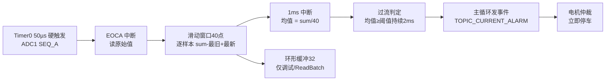

# 过流优化 0807

> 日期：2026-08-07　分支：`restore-b948c7e`（改动未提交）　工程：HB_chuchai_v2.0.0（HC32F460）

## 1. 背景与目标

- 工况：**直流有刷电机关窗器**，通过**堵转电流**判断窗户是否关紧。
- 问题：直流有刷电机电流存在周期性抖动（实测周期约 **2ms**），且**堵转时平均电流越大，抖动幅值越大**：
  - 阈值 1.1A 时：停车前瞬间抖动峰值约 1.3A；
  - 阈值 1.6A 时：停车前瞬间约 1.6A ~ 2.7A（平均约 2.15A）。
- 目标：**电机在“电流平均值 = 设定阈值”时停住**（阈值 1.1A 就应在平均 1.1A 时停车）。

## 2. 当前策略（0807 版）

### 2.1 ADC 采样
- 采样周期：**50µs（20kHz）**，宏 `ADC_SAMPLE_INTERVAL_US = 50U`（`Adp/Adc.h`）。
- ADC1 SEQ_A 由 Timer0（TMR0_1 CH_B）硬触发，EOCA 中断逐通道读取。

### 2.2 均值滤波：固定 N 点滑动平均
- 窗口：**40 点 = 2ms = 1 个完整纹波周期**（整数倍周期 → 精确抵消纹波，与纹波幅值无关）。
- EOCA 中断（20kHz）里**逐样本**维护滑动窗口和：`sum = sum - 最旧 + 最新`（`Dev/dev_adc.c` `ADC_Device_OnDataReady`）。
- 1ms 中断里取 `sum / 40` 作为判定值（`Dev/dev_adc.c` `ADC_Device_UpdateFilter`）。
- 环形缓冲（32 点）**保留仅作调试**（`ReadBatch` 用），**不再是均值数据源**。

### 2.3 消费与调度（单消费者）
- 环形缓冲 / ADC 更新**只由 1ms 中断**（`TMR0_Unit2_1msTask`）消费。
- **主循环 ADC update 全程禁用**：`ESystem_Init` 中把 `SetDeviceUpdateIntervals()` 调整到 `DeviceManager_EnableAllUpdate()` **之后**执行，保证 `ID_ADC_CURRENT / ID_ADC_VOLTAGE` 的 `DisableUpdate` 不被覆盖（`App/App_Motor_Project.c`）。
- 传感器零位校准：**EOCA 采集保持开启**；校准读取 1ms 中断产出的均值缓存（`Device_Read`）；主循环只保留 `Sensor_Device_Update` 校准状态机（`ID_SENSOR_CURRENT` 的 update 保留）。

### 2.4 过流判定
- 判定值：**40 点滑动平均**，每 **1ms** 刷新一次判定。
- 模式：**时间窗口**（`OVERCURRENT_MODE_TIME_WINDOW`）。
- 阈值：`current_upper_limit`，默认 **1100mA**（Modbus 寄存器 `0x2716`）。
- 触发条件：**平均值 ≥ 阈值，持续 `current_detect_ms = 2ms`** → 判定过流。
- 触发点 = 阈值 + 滞回（当前滞回 `current_hysteresis_ma = 0`）。
- 清除方式：**手动**（`OVERCURRENT_CLEAR_MANUAL`）；释放窗口 `current_release_ms` 默认 200ms。
- 触发后链路：1ms ISR 置 pending → 主循环 `ProcessSensorPendingEvents` 发布 `TOPIC_CURRENT_ALARM` → `Motor_OnCurrentAlarm` → 仲裁决策 → 立即停车（`Motor_SetStopDuty`）。

## 3. 参数与文件对照表

| 参数 | 宏 / 寄存器 | 文件 | 当前值 |
|---|---|---|---|
| ADC 采样周期 | `ADC_SAMPLE_INTERVAL_US` | `Adp/Adc.h` | 50U（20kHz） |
| 均值窗口点数 | `ADC_MEAN_WINDOW_SAMPLES` | `Dev/dev_adc.h` | 40U（2ms=1个纹波周期） |
| 滤波类型 | `ADC_DEFAULT_FILTER_TYPE` | `Dev/dev_adc.h` | `ADC_FILTER_MEAN` |
| 滤波更新间隔 | `ADC_DEFAULT_FILTER_INTERVAL` | `Dev/dev_adc.h` | 0（每次Update都执行） |
| 过流阈值 | `current_upper_limit` / `0x2716` | `App_Params.h` | 1100mA |
| 过流判定时间 | `current_detect_ms` / `0x271E` | `App_Params.h` | 2U（2ms） |
| 过流滞回 | `current_hysteresis_ma` | `App_Params.h` | 0 |
| 过流释放窗口 | `current_release_ms` | `App_Params.h` | 200U |
| 触发计数（时间模式未用） | `overcurrent_trigger_count` | `App_Params.h` | 1 |
| 过流模式 | `OVERCURRENT_MODE` | `App_Motor_Project.h` | `OVERCURRENT_MODE_TIME_WINDOW` |
| 清除模式 | `OVERCURRENT_CLEAR_MODE` | `Dev/dev_sensor.h` | `OVERCURRENT_CLEAR_MANUAL` |

## 4. 数据流

## 5. 调参说明

- **窗口换算**（50µs 采样下）：`点数 = 纹波周期(ms) × 20 × 周期数`，必须取**整数倍周期**才能精确抵消纹波。
  - 2ms 周期：40 点（1 周期，当前）/ 80 点（2 周期，更平滑但滞后 +2ms）。
- **`current_detect_ms`**：均值已平滑，1~2ms 足够；越小，停车超调越小（当前 2，可试 1）。
- **阈值**：默认 1100mA；想“停车即平均=阈值”时，阈值直接设为目标平均电流。
- 若高阈值（如 1.6A）下停车点仍偏高：优先把 `current_detect_ms` 降到 1；或接受少量超调——**堵转电流爬升的机械延迟无法被滤波消除**。

## 6. 实测现象与验证方法

- 修改前现象（记录）：纹波周期 2ms；1.1A 阈值停车前峰值约 1.3A；1.6A 阈值停车前 1.6~2.7A（平均约 2.15A）。
- 验证：
  1. Keil 重新编译烧录；
  2. JScope 观察 `g_dbg_current_filtered_ma`：应**平滑无 2ms 纹波**；
  3. 分别用 1.1A / 1.6A 阈值堵转，对比**停车瞬间平均值**是否≈阈值。
- 注意：纹波周期可能有波动，若实测周期变化，按第 5 节公式重新调整 `ADC_MEAN_WINDOW_SAMPLES`。

## 7. 本次改动文件清单（未提交）

| 文件 | 改动 |
|---|---|
| `Adp/Adc.h` | `ADC_SAMPLE_INTERVAL_US` 100U → 50U |
| `Dev/dev_adc.h` | 新增 `ADC_MEAN_WINDOW_SAMPLES`(40U) 与滑动窗口结构体字段、注释更新 |
| `Dev/dev_adc.c` | EOCA 中断逐样本滑动平均；`UpdateFilter` 改用滑动窗口；删除 `ADC_Filter_Mean`；`Init` 初始化窗口 |
| `App/App_Motor_Project.c` | 初始化顺序调整：`EnableAllUpdate()` 之后再 `SetDeviceUpdateIntervals()`，确保 ADC 主循环轮询保持禁用 |
| `Utils/App_Params.h` | `PARAM_DEFAULT_CURRENT_DETECT_MS` 10 → 2U |